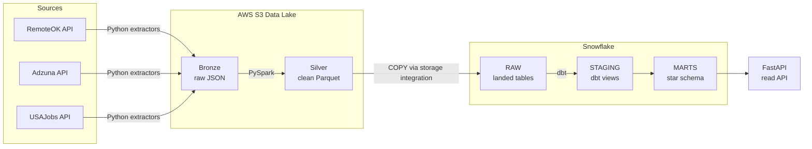

# Pulse — Track Trends. Discover Opportunities.

**Pulse** is a production-grade, end-to-end data platform that ingests job postings from
multiple live sources, cleans and conforms them with Spark, models them into a dimensional
warehouse with dbt, and serves analytics over the AI / ML / Data job market — all
orchestrated as a single scheduled Airflow pipeline.

It is built as a faithful, scaled-down version of how a real data team would stand up a
medallion lakehouse: immutable raw capture, a distributed transform layer, a star-schema
warehouse, automated tests, and a read API on top.

---

## Architecture



Every stage is a task in one Airflow DAG (`pulse_pipeline`), so the whole flow runs daily
on a single logical date with no manual intervention.

---

## Tech stack

| Layer            | Technology                                   |
|------------------|----------------------------------------------|
| Ingestion        | Python (requests, retry/backoff)             |
| Data lake        | AWS S3 (medallion: bronze / silver)          |
| Transform        | Apache Spark 3.5 (PySpark), Dockerized       |
| Warehouse        | Snowflake (storage integration + COPY)       |
| Modeling / tests | dbt (star schema, schema & relationship tests)|
| Orchestration    | Apache Airflow 3 (Astro Runtime)             |
| Serving          | FastAPI (read-only analytics API)            |
| Packaging        | Docker / Docker Compose                      |

---

## Data sources

Three independent public job APIs, each behind its own extractor:

- **RemoteOK** — remote tech roles
- **Adzuna** — broad US job market (paginated search)
- **USAJobs** — US federal IT postings (category 2210)

Adding a fourth source is intentionally cheap: write one extractor and one silver mapping.
No warehouse or dbt changes are required (see *Design decisions*).

---

## Pipeline stages (medallion)

1. **Bronze** — Each extractor pulls a source and lands the raw JSON, untouched, to
   `s3://<bucket>/bronze/source=<X>/ingestion_date=<ds>/`. Raw capture is immutable and
   replayable.
2. **Silver** — A PySpark job per source reads its bronze file, conforms it to a single
   unified schema (`posting_id, source, title, company, location, salary_*, is_remote,
   job_url, posted_at, ingestion_date`), extracts skills, and writes partitioned Parquet to
   `silver/`.
3. **RAW (Snowflake)** — A storage integration + `COPY` loads all silver Parquet into
   `PULSE.RAW`. Loads are incremental via Snowflake's load history.
4. **STAGING (dbt)** — Views that type, clean, and de-duplicate the raw tables.
5. **MARTS (dbt)** — A Kimball-style star schema, materialized as tables.

---

## Data model

A conformed star schema in `PULSE.MARTS`:

**Dimensions** — `dim_source`, `dim_company`, `dim_location`, `dim_skill`, `dim_role`,
`dim_date`
**Facts** — `fact_job_posting` (grain: one posting) and `fact_job_skill` (bridge:
posting × skill)

Surrogate keys use Snowflake-native `md5()` hashes, and the marts ship with dbt
`unique` / `not_null` / `relationships` tests so referential integrity is enforced on
every run.

---

## Orchestration

The `pulse_pipeline` DAG (`@daily`, `catchup=False`, retries on failure) wires the stages
together:

```
extract_remoteok ┐
extract_adzuna   ├─→ silver_<src> (pulse-spark container) ─┐
extract_usajobs  ┘                                          ├─→ load_raw ─→ dbt_run ─→ dbt_test
```

- **extract_** tasks run the Python extractors in-process.
- **silver_** tasks launch the `pulse-spark` image as sibling containers via the mounted
  Docker socket, reusing the exact Spark/Java environment.
- **load_raw** runs the Snowflake `COPY` statements.
- **dbt_run / dbt_test** build and validate the warehouse models.

A single `{{ ds }}` is threaded through extract and silver, so the run date is one source of
truth — eliminating the date-drift bugs that plague manually parameterized runs.

---

## Running it locally

**Prerequisites:** Docker Desktop, the [Astro CLI](https://docs.astronomer.io/astro/cli/overview),
Python 3.12, and accounts/keys for AWS (S3), Snowflake, Adzuna, and USAJobs.

```bash
# 1. Configure secrets
cp .env.example .env        # then fill in your AWS / Snowflake / API keys

# 2. Provision the warehouse (one-time)
#    run the scripts in sql/ in Snowflake (database, storage integration, stage)

# 3. Build the Spark image used by the silver tasks
docker build -t pulse-spark -f spark/Dockerfile .

# 4. Start Airflow (Astro)
astro dev start

# 5. Run the whole pipeline for a date
astro dev run dags test pulse_pipeline 2026-06-15
```

Open the Airflow UI at `localhost:8080` and unpause `pulse_pipeline` to run it on schedule.

---

## Project structure

```
.
├── pulse/                 # ingestion package (extractors, bronze writer, config)
│   └── extractors/        # remoteok, adzuna, usajobs (+ shared base)
├── spark/                 # PySpark silver jobs + Spark Dockerfile
├── sql/                   # Snowflake setup, storage integration, stage/COPY
├── dbt/                   # dbt project (staging views, marts star schema, tests)
├── dags/                  # Airflow DAGs (pulse_pipeline, ingest_remoteok)
├── api/                   # FastAPI read API over the marts
├── requirements.txt       # Airflow image deps (docker, snowflake, dbt-snowflake)
├── Dockerfile             # Astro runtime image
├── docker-compose.override.yml   # mounts the Docker socket for silver tasks
└── .env.example           # required environment variables
```

---

## Design decisions

A few choices that make the project robust rather than just functional:

- **Source-agnostic silver schema.** Every source maps to one unified shape, so the
  warehouse and dbt layer never need to know how many sources exist. New source = one
  extractor + one mapping.
- **Medallion separation.** Raw bronze is immutable and replayable; silver is the only
  place cleaning logic lives; marts are pure modeling. Failures are isolated to a layer.
- **Native `md5()` surrogate keys.** Removes the `dbt_utils` dependency and keeps key
  generation inside the warehouse.
- **Spark pinned to Java 17.** Spark 3.5 doesn't support Java 21; the Spark image pins
  `python:3.11-slim-bookworm` to get a compatible JVM — a real interop gotcha, solved once.
- **Storage integration over access keys.** Snowflake reads S3 via an IAM role, not
  long-lived credentials.
- **Idempotent, date-driven runs.** Incremental `COPY` + a single threaded run date make
  re-runs safe.
- **Reproducible config, no secrets in git.** The dbt profile is generated at task runtime
  from environment variables; `.env.example` documents every key.

---

## Possible extensions

- Stand up the FastAPI service and a BI dashboard (salary trends, in-demand skills,
  remote vs. on-site).
- CI with GitHub Actions (lint, `dbt compile`, DAG import checks).
- A natural-language → SQL assistant over the marts.

---

## Author

**Jaya Surya Sasank** — MS Computer Science, Virginia Commonwealth University
GitHub: [@suryasasank11](https://github.com/suryasasank11)